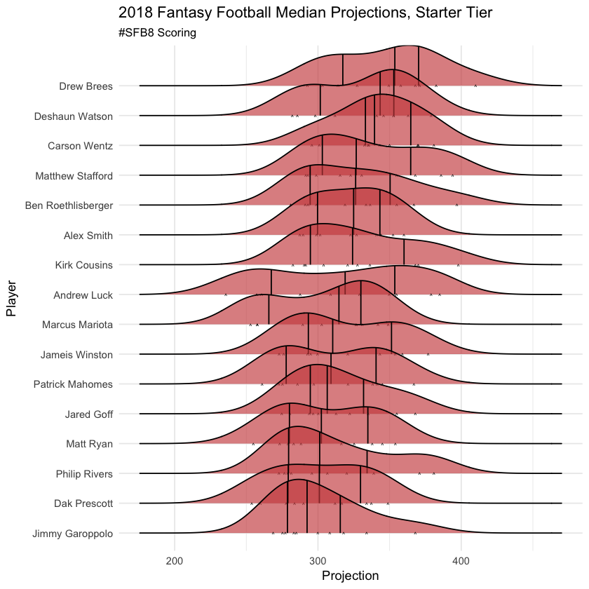

# Fantasy Football Projections 2018 work-in-progress

A project where I scrape multiple sources of Fantasy Football projections, from various analyists and industry thought-leaders, and graphs the distributions of these projections. It also converts the projections to a recently ubiquitized scoring-system, developed by Scott Fish (Twitter: @ScottFish24), through his vast charity tournaments and adjacent satellite leagues. 

Currently, the data is scraping from private,individually edited gSheets, adjusted for specific league scoring. Over time, the manipulations will be moved from the sheets to R code below.

### Install and Load Packages


```R
install.packages(
  c(
    "dplyr",
    "ggridges",
    "ggplot2",
    "jsonlite",
    "gsheet",
    "readr"
  )
)
```


```R
library(dplyr)
library(ggridges)
library(ggplot2)
library(jsonlite)
library(gsheet)
library(readr)
```

### Gather Projections from gSheets


```R
#Gather the SFB Eliminator Projections
# Masking source names to not "out" paid sources. Some sources have multiple projectors, erasing for the public

#Source1
source1.sfb8 <- gsheet2tbl(
  'https://docs.google.com/spreadsheets/d/1F-Uyplgbad08BaVVFnrzr3cCeiC8I6qCtpn9vqRkVSc/edit#gid=1142013131'
)
source1.sfb8$Projector <- "source1"
names(source1.sfb8)[3]<-"Proj"
#Source2
source2.sfb8 <- gsheet2tbl(
  'https://docs.google.com/spreadsheets/d/1u-oKhnDp2ZLW6Q9ZomA2iRArYrif3ee3haj2-_TBI2k/edit#gid=1854830971'
)
source2.sfb8$Projector <- "source2"
names(source2.sfb8)[3]<-"Proj"


#Source3
source3.sfb8 <- gsheet2tbl(
  'https://docs.google.com/spreadsheets/d/1me8J0aq8V6Sa0YNIh7h63ThZ1pwucJJHjkxx1R5cvVE/edit#gid=265455049'
)
source3.sfb8$Projector <- "source3"
names(source3.sfb8)[3]<-"Proj"


#Source4
source4.sfb8 <- gsheet2tbl(
  'https://docs.google.com/spreadsheets/d/10CSVxs3wlou51hM6vdI-k6b74QP7wKKI2CL9cyB3dyY/edit#gid=896714279'
)
source4.sfb8$Projector <- "source4"
names(source4.sfb8)[3]<-"Proj"


#Source5
source5.sfb8 <- gsheet2tbl(
  'https://docs.google.com/spreadsheets/d/1wNBhCG1eKAUQ2oX3JkcgyUz9km-3DnDwTke8f5ZaNsk/edit#gid=1178427244'
)
source5.sfb8$Projector <- "source5"
names(source5.sfb8)[3]<-"Proj"
```

### Combine Sources


```R
#Combine the Projections
sfb8.proj <- rbind(source1.sfb8,source2.sfb8,source3.sfb8, source4.sfb8, source5.sfb8)

#Adjust Julian Edelman's Projection (using Totals)
sfb8.proj$Proj<- 
  ifelse(sfb8.proj$Player == "Julian Edelman",
         (sfb8.proj$Proj/16)*12,
         sfb8.proj$Proj)

#add an Average Projection Column
sfb8.averages <- sfb8.proj %>% select(-Projector) %>% 
  group_by(Player, Pos) %>%
  summarise_all(mean,na.rm=T)
names(sfb8.averages)[3]<-"avg.Proj"
sfb8.proj <- merge(sfb8.proj, sfb8.averages, by =c("Player","Pos"))
```


```R
sfb8.proj <- sfb8.proj %>% arrange(c(desc(Proj)))
head(sfb8.proj)
```


<table>
<thead><tr><th scope=col>Player</th><th scope=col>Pos</th><th scope=col>Proj</th><th scope=col>Projector</th><th scope=col>avg.Proj</th></tr></thead>
<tbody>
	<tr><td>Aaron Rodgers </td><td>QB            </td><td>470.0000      </td><td>source2       </td><td>400.8158      </td></tr>
	<tr><td>Aaron Rodgers </td><td>QB            </td><td>451.0000      </td><td>source2       </td><td>400.8158      </td></tr>
	<tr><td>Aaron Rodgers </td><td>QB            </td><td>437.0576      </td><td>source4       </td><td>400.8158      </td></tr>
	<tr><td>Aaron Rodgers </td><td>QB            </td><td>433.0000      </td><td>source2       </td><td>400.8158      </td></tr>
	<tr><td>Russell Wilson</td><td>QB            </td><td>415.0000      </td><td>source2       </td><td>361.7669      </td></tr>
	<tr><td>Drew Brees    </td><td>QB            </td><td>410.0000      </td><td>source2       </td><td>347.6069      </td></tr>
</tbody>
</table>


## Projections


```R
#create colors for the standard fantasy positions
Poscolors <- c(
  "#ce4b4b", 
  "#009E73", 
  "#8679bf", 
  "#ffb31a",
  "##42f4d9")

names(Poscolors) <- c("QB","RB","TE","WR","D/ST")
```

#### Elite Players


```R
#Graph Distribution of Projections by the Elite Tier of FLEX Players, projected for 250 or more FPTs

sfb8.proj %>%
  filter(avg.Proj > 250, Pos != "QB") %>%
  mutate(Player = reorder(Player, Proj, median)) %>%
  ggplot()+
  aes(x = Proj, y = Player, fill = Pos)+
  geom_density_ridges(
    alpha=.65, jittered_points = T,
    position = position_points_jitter(width = 0.05, height = 0),
    quantile_lines = T,
    point_shape = '^', point_size = 1.5
  )+
  scale_fill_manual(values = Poscolors)+
  guides(fill=FALSE)+
  theme_minimal()+
  labs(
    x = "Projection",
    title = "2018 Fantasy Football Median Projections, Elite Tier",
    subtitle = "#SFB8 Scoring"
  )
```

    Picking joint bandwidth of 9.27


#### Notes

Rob Gronkowski offers unique upside in this format, even compared to normal fantasy leagues if he manages to stay healthy for a full season. Keenan Allen was the WR1 overall for the final stretch of the season, after not producing to-expectation in the first half of the year. It appears most analysts are predicting Allen to be closer to his second-half numbers. Zach Ertz's projections are right in line with Travis Kelce, likely do to the uncertainty surrounding Patrick Mahomes, and the addition of Sammy Watkins to the Kansas City receiving corp. Antonio Brown has an absurdly condensed median projection. Assuming health, there's only one outcome analysts expect: dominance.


```R
#Graph Distribution of Projections by the Elite Tier of FLEX Players, projected for 250 or more FPTs

sfb8.proj %>%
  filter(avg.Proj > 350, Pos == "QB") %>%
  mutate(Player = reorder(Player, Proj, median)) %>%
  ggplot()+
  aes(x = Proj, y = Player, fill = Pos)+
  geom_density_ridges(
    alpha=.65, jittered_points = T,
    position = position_points_jitter(width = 0.05, height = 0),
    quantile_lines = T,
    point_shape = '^', point_size = 1.5
  )+
  scale_fill_manual(values = Poscolors)+
  guides(fill=FALSE)+
  theme_minimal()+
  labs(
    x = "Projection",
    title = "2018 Fantasy Football Median Projections, Elite Tier",
    subtitle = "#SFB8 Scoring"
  )
```

    Picking joint bandwidth of 20.5


### Fantasy Starters


```R
#Graph Distribution of Projections by the Top Tier of FLEX Players, projected for 200-250 or more FPTs

sfb8.proj %>%
  filter(avg.Proj > 200, avg.Proj < 251, Pos != "QB") %>%
  mutate(Player = reorder(Player, Proj, median)) %>%
  ggplot()+
  aes(x = Proj, y = Player, fill = Pos)+
  geom_density_ridges(
    alpha=.65, jittered_points = T,
    position = position_points_jitter(width = 0.05, height = 0),
    quantile_lines = T,
    point_shape = '^', point_size = 1.5
  )+
  scale_fill_manual(values = Poscolors)+
  theme_minimal()+
  guides(fill=FALSE)+
  labs(
    x = "Projection",
    title = "2018 Fantasy Football Median Projections, Starter Tier",
    subtitle = "#SFB8 Scoring"
  )
```

    Picking joint bandwidth of 8.48


```R
#Graph Distribution of Projections by the Top Tier of QBs projected for 300-350 FPTs

sfb8.proj %>%
  filter(avg.Proj > 300, avg.Proj < 351, Pos == "QB") %>%
  mutate(Player = reorder(Player, Proj, median)) %>%
  ggplot()+
  aes(x = Proj, y = Player, fill = Pos)+
  geom_density_ridges(
    alpha=.65, jittered_points = T,
    position = position_points_jitter(width = 0.05, height = 0),
    quantile_lines = T,
    point_shape = '^', point_size = 1.5
  )+
  scale_fill_manual(values = Poscolors)+
  theme_minimal()+
  guides(fill=FALSE)+
  labs(
    x = "Projection",
    title = "2018 Fantasy Football Median Projections, Starter Tier",
    subtitle = "#SFB8 Scoring"
  )
```

    Picking joint bandwidth of 20





```R
#Graph Distribution of Projections by the Mid Tier of FLEX Players, projected for 161-200 FPTs


sfb8.proj %>%
  filter(avg.Proj > 160, avg.Proj < 201, Pos != "QB") %>%
  mutate(Player = reorder(Player, Proj, median)) %>%
  ggplot()+
  aes(x = Proj, y = Player, fill = Pos)+
  geom_density_ridges(
    alpha=.65, jittered_points = T,
    position = position_points_jitter(width = 0.05, height = 0),
    quantile_lines = T,
    point_shape = '^', point_size = 1.5
  )+
  scale_fill_manual(values = Poscolors)+
  theme_minimal()+
  guides(fill=FALSE)+
  labs(
    x = "Projection",
    title = "2018 Fantasy Football Median Projections, Mid Tier",
    subtitle = "#SFB8 Scoring"
  )

```

    Picking joint bandwidth of 8.79


```R
#Graph Distribution of Projections by the QBs projected for 200-300 FPTs

sfb8.proj %>%
  filter(avg.Proj > 199, avg.Proj < 301, Pos == "QB") %>%
  mutate(Player = reorder(Player, Proj, median)) %>%
  ggplot()+
  aes(x = Proj, y = Player, fill = Pos)+
  geom_density_ridges(
    alpha=.65, jittered_points = T,
    position = position_points_jitter(width = 0.05, height = 0),
    quantile_lines = T,
    point_shape = '^', point_size = 1.5
  )+
  scale_fill_manual(values = Poscolors)+
  theme_minimal()+
  guides(fill=FALSE)+
  labs(
    x = "Projection",
    title = "2018 Fantasy Football Median Projections, Low-End Starter Tier",
    subtitle = "#SFB8 Scoring"
  )
```

    Picking joint bandwidth of 23.4


```R
sfb8.proj %>%
  filter(avg.Proj > 120, avg.Proj < 161, Pos != "QB") %>%
  mutate(Player = reorder(Player, Proj, median)) %>%
  ggplot()+
  aes(x = Proj, y = Player, fill = Pos)+
  geom_density_ridges(
    alpha=.65, jittered_points = T,
    position = position_points_jitter(width = 0.05, height = 0),
    quantile_lines = T,
    point_shape = '^', point_size = 1.5
  )+
  scale_fill_manual(values = Poscolors)+
  theme_minimal()+
  guides(fill=FALSE)+
  labs(
    x = "Projection",
    title = "2018 Fantasy Football Median Projections, Low Tier",
    subtitle = "#SFB8 Scoring")
```

    Picking joint bandwidth of 9.64


```R
sfb8.proj %>%
  filter(avg.Proj > 90, avg.Proj < 121, Pos != "QB") %>%
  mutate(Player = reorder(Player, Proj, median)) %>%
  ggplot()+
  aes(x = Proj, y = Player, fill = Pos)+
  geom_density_ridges(
    alpha=.65, jittered_points = T,
    position = position_points_jitter(width = 0.05, height = 0),
    quantile_lines = T,
    point_shape = '^', point_size = 1.5
  )+
  scale_fill_manual(values = Poscolors)+
  theme_minimal()+
  guides(fill=FALSE)+
  labs(
    x = "Projection",
    title = "2018 Fantasy Football Median Projections, Bargain Tier",
    subtitle = "#SFB8 Scoring"
  )
```

    Picking joint bandwidth of 10.9


```R
#Graph Distribution of Projections by the QBs projected for 100-200 FPTs

sfb8.proj %>%
  filter(avg.Proj > 99, avg.Proj < 201, Pos == "QB") %>%
  mutate(Player = reorder(Player, Proj, median)) %>%
  ggplot()+
  aes(x = Proj, y = Player, fill = Pos)+
  geom_density_ridges(
    alpha=.65, jittered_points = T,
    position = position_points_jitter(width = 0.05, height = 0),
    quantile_lines = T,
    point_shape = '^', point_size = 1.5
  )+
  scale_fill_manual(values = Poscolors)+
  theme_minimal()+
  guides(fill=FALSE)+
  labs(
    x = "Projection",
    title = "2018 Fantasy Football Median Projections, Uncertainty Tier",
    subtitle = "#SFB8 Scoring"
  )
```

    Picking joint bandwidth of 37.8


